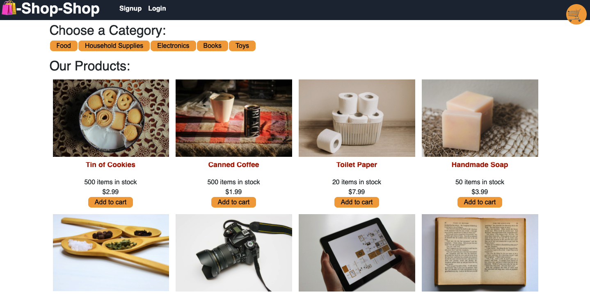

# Mern Shopping ©2021 

## Description
This is a mern stack shopping app generated with redux actions and reducers

Project by: Aimee J  
Main Github: [MissAimeeJay](https://github.com/MissAimeeJay)
Repository Link: https://github.com/MissAimeeJay/shop-shop  
Live Page Url:  
[https://infinite-waters-85303.herokuapp.com/](https://infinite-waters-85303.herokuapp.com/)

## Table of Contents

* [Installation](#installation)
* [Usage](#usage)
* [Contributon](#credits)
* [License](#license)
* [Testing](#testing)
* [Questions](#questions)

## Installation
The app should be completely usuable from the live link URL but users can also clone the repository and run `npm i` in the command line to install all of the dependencies

## Usage 
This app is used for ecommerce shopping

## Contribution
Starter code provided by Trilogy Learning Inc

## License

[Click here for more information on this license](https://choosealicense.com/licenses/unlicense)

## Testing
None

## Questions
If you have questions or would like to contact for other reasons, please contact
Aimee J  
Email: ajesso@post.com
Main Github: [MissAimeeJay](https://github.com/MissAimeeJay)
